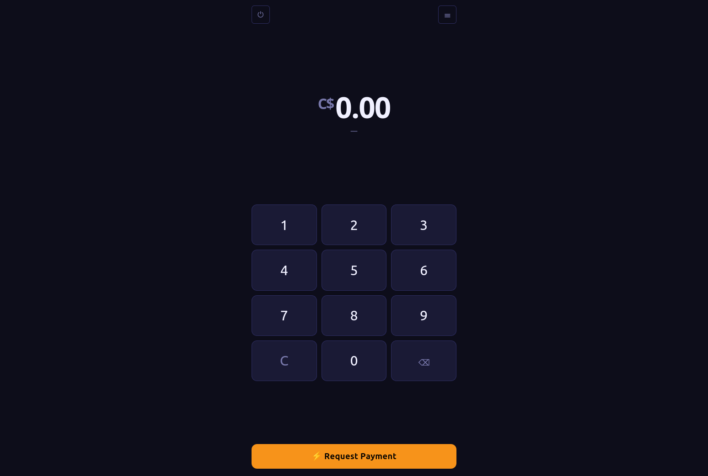
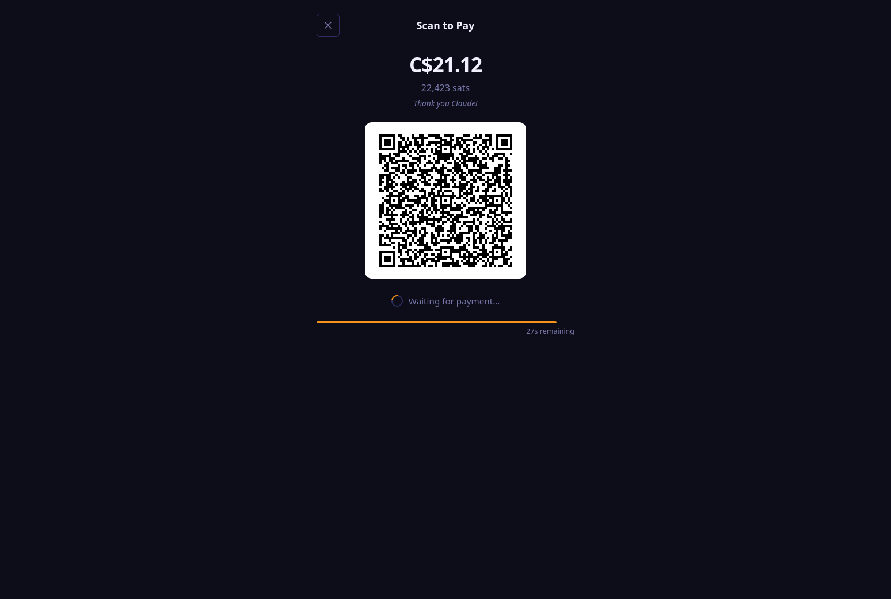
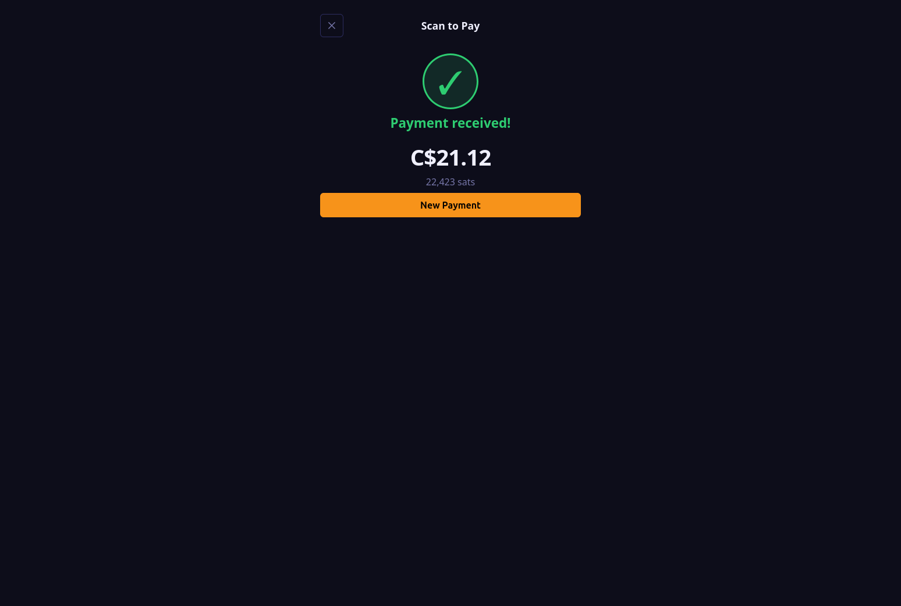

# Telecommander ⚡

A Lightning Point of Sale web application. Connect to your LND node over [Lightning Node Connect](https://github.com/lightninglabs/lnc-web), enter an amount, and display a payment QR code — no backend required.

!!! Built with Claude !!! Use with caution !!!

## Requirements

- Node.js 18+
- An LND node running [Lightning Terminal](https://github.com/lightninglabs/lightning-terminal) (`litd`)

## Installation

```bash
git clone https://github.com/your-username/telecommander
cd telecommander
npm install
```

## Running

### Development

```bash
npm run dev
```

Starts a local dev server at `http://localhost:3000` with hot reload.

To make the app accessible to other devices on the same network (e.g. a tablet at the counter):

```bash
npm run dev -- --host
```

Vite will print both the localhost and LAN addresses.

### Production build

```bash
npm run build
```

Outputs a static site to `dist/`. Serve it with any web server, for example:

```bash
npm run preview        # Vite's built-in preview server (localhost:4173)
npx serve dist         # Alternative using the 'serve' package
python3 -m http.server --directory dist 8080
```

## First-time setup

1. Generate an LNC session on your node with invoice permissions. You may use LND Accounts to ensure the application runs with limited permissions:

   ```bash
   litcli accounts create 0
   litcli sessions add --label "telecommander" --type account --account_id 1faccountid...
   ```

   > **Note:** A pure `readonly` session cannot create invoices. Ensure the session has write access to invoices.

2. Open the app in your browser and enter:
   - The **pairing phrase** shown by `litcli`
   - A **local password** used to encrypt the credentials in your browser
   - Optionally, a custom **proxy server** if you are not using the default `mailbox.terminal.lightning.today:443`

3. Configure your **fiat currency**, **exchange rate API**, **default memo**, and **invoice timeout**.

4. You are ready to accept payments.

## Returning sessions

On subsequent visits the app only asks for your local password — the pairing phrase is not required again. Use the **⏻** button on the numpad screen to log out and remove credentials from the browser.

## How it works

- All LND communication happens in the browser via the `lnc-web` WebAssembly client — no server-side component is needed.
- Credentials (local key, remote key, proxy address) are encrypted with your local password and stored in `localStorage`.
- Exchange rates are fetched from the configured public API. No rate data is sent to your node.
- Invoice status is polled every 2 seconds until paid or expired.

## Examples






